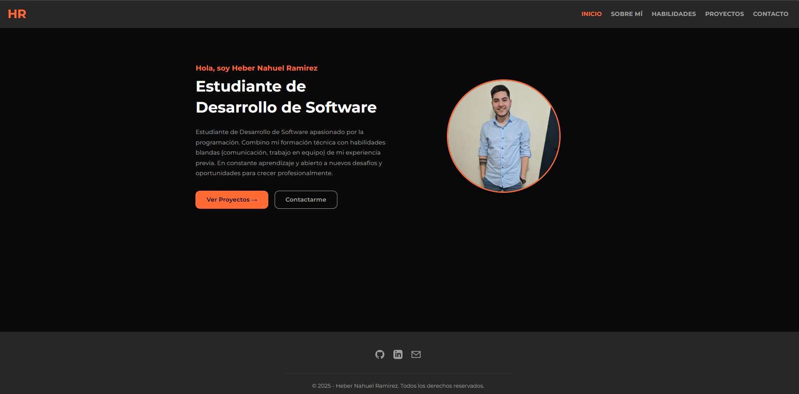
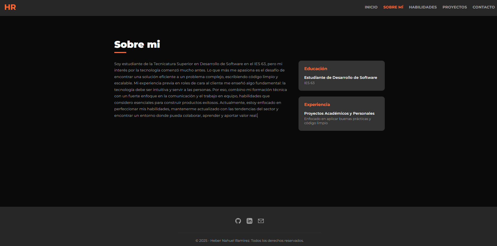
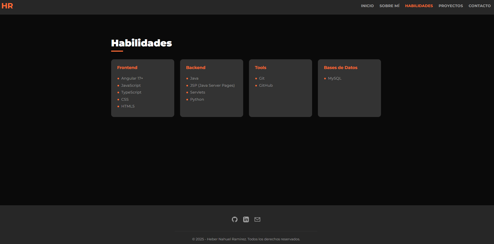
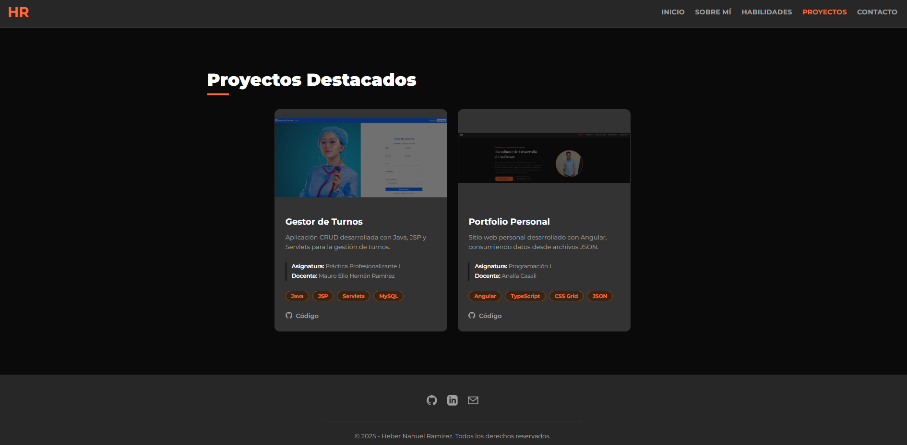
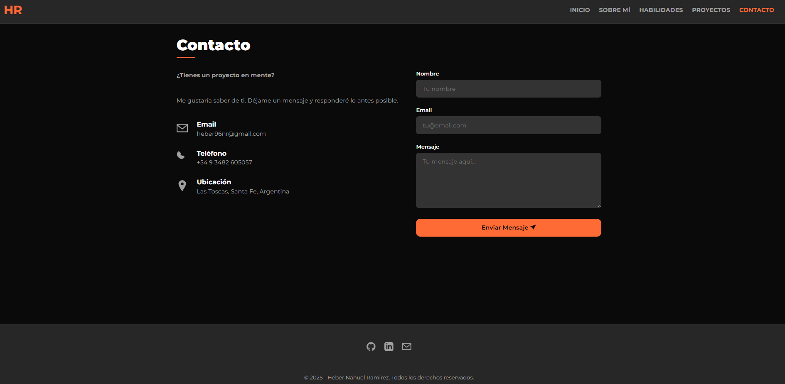

# 💼 Mi Portfolio Personal (Angular)

Este proyecto es mi portfolio web personal, desarrollado como parte de mi formación en la **Tecnicatura Superior en Desarrollo de Software**. El sitio presenta mi perfil profesional, los proyectos que he realizado y las tecnologías que manejo.

Toda la información del sitio es dinámica: se consume desde archivos JSON locales (`personal.json`, `proyectos.json`, `habilidades.json`) utilizando el `HttpClient` de Angular y un servicio dedicado (`PortfolioService`).

---

## 🚀 Tecnologías Utilizadas

- **Angular (v17+)**: Construido con componentes Standalone.
- **TypeScript**: Para un código robusto y tipado.
- **Angular Router**: Para la navegación SPA (Single Page Application).
- **Reactive Forms**: Para el formulario de contacto con validaciones.
- **CSS Moderno**: Maquetación con Flexbox, Grid y variables CSS para un diseño responsive.
- **Consumo de JSON**: Carga de datos de forma asíncrona usando `HttpClient`.

---

## 📸 Capturas de Pantalla

### Página de Inicio (Hero Section)



### Página Sobre mi



### Sección de Habilidades



### Sección de Proyectos



### Formulario de Contacto



---

## 🏃‍♂️ Instalación y Ejecución

Sigue estos pasos para levantar el proyecto en tu entorno local.

### Prerrequisitos

Asegúrate de tener instalado [Node.js](https://nodejs.org/) (se recomienda la versión LTS) y [Angular CLI](https://angular.io/cli).

### Pasos

1.  Clona el repositorio:

    ```bash
    git clone [https://github.com/HeberNR/portfolio-angular.git](https://github.com/HeberNR/portfolio-angular.git)
    ```

2.  Navega a la carpeta del proyecto:

    ```bash
    cd portfolio-angular
    ```

3.  Instala las dependencias de Node:

    ```bash
    npm install
    ```

4.  Inicia el servidor de desarrollo de Angular:
    ```bash
    ng serve -o
    ```

La bandera `-o` (o `--open`) abrirá automáticamente el proyecto en tu navegador en `http://localhost:4200/`.

---

## 👨‍💻 Autor

**Heber Nahuel Ramirez**

- [LinkedIn](https://www.linkedin.com/in/hebernr/)
- [GitHub](https://github.com/HeberNR)
